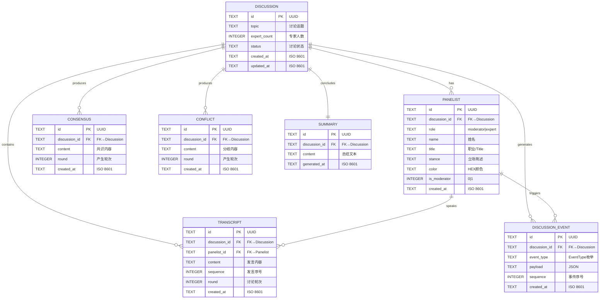

# 数据库 ER 图

> 版本: v1.0 | 日期: 2026-06-26 | 状态: Draft

---

## 1. ER 图

---

## 2. 表结构速查

| 表名 | 主键 | 外键 | 索引建议 |
|---|---|---|---|
| `discussion` | id (UUID) | — | status, created_at |
| `panelist` | id (UUID) | discussion_id | discussion_id |
| `transcript` | id (UUID) | discussion_id, panelist_id | discussion_id, sequence |
| `discussion_event` | id (UUID) | discussion_id | discussion_id, sequence |
| `consensus` | id (UUID) | discussion_id | discussion_id, round |
| `conflict` | id (UUID) | discussion_id | discussion_id, round |
| `summary` | id (UUID) | discussion_id | discussion_id (UNIQUE) |

---

<!-- TODO: 后续根据实际建表语句微调字段类型，确保与 SQLite 兼容 -->
