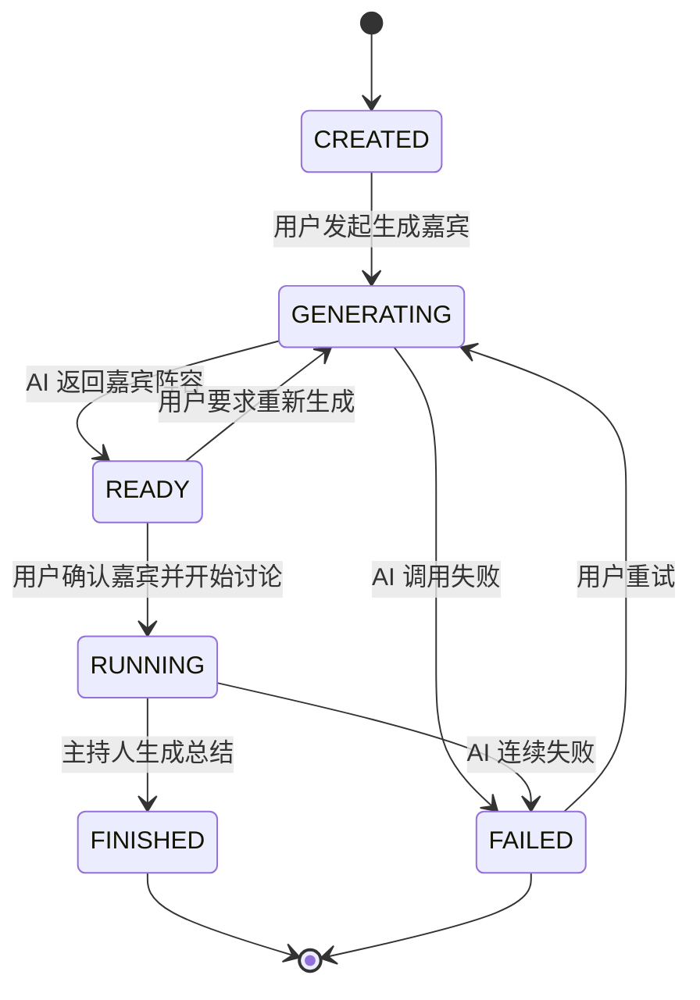

# 领域模型 (Schema Definition)

> 版本: v1.1 | 日期: 2026-06-26 | 状态: Revised

---

## 0. 设计原则：Persistent vs Runtime

在定义实体之前，先确立核心分类原则：

| 分类 | 定义 | 存储策略 |
|---|---|---|
| **Persistent Entity** | 需要在讨论结束后回看、断线重连后恢复、跨请求共享的数据 | 存入 SQLite 表 |
| **Runtime Entity** | 仅在当前讨论会话存活期间有意义、随讨论结束而消亡的数据 | 仅存在于内存，不落盘 |

**判断标准**：一个数据对象在用户关闭浏览器、第二天重新打开时是否仍然需要？是 → Persistent；否 → Runtime。

---

## 1. 实体总览

### 1.1 Persistent Entities（持久化）

| 实体 | 说明 | 表名 |
|---|---|---|
| **Discussion** | 一场圆桌讨论的聚合根 | `discussion` |
| **Panelist** | 参会嘉宾（主持人 + 专家） | `panelist` |
| **Transcript** | 发言记录 | `transcript` |
| **DiscussionEvent** | SSE 事件日志（仅持久化可回放事件） | `discussion_event` |
| **Consensus** | 共识条目 | `consensus` |
| **Conflict** | 分歧条目 | `conflict` |
| **Summary** | 讨论总结 | `summary` |

### 1.2 Runtime Entities（运行时）

| 实体 | 说明 | 存活范围 |
|---|---|---|
| **ExpertStatus** | 每位专家的当前运行状态 + 公开思考摘要 | 单场讨论会话 |
| **Scheduler** | 发言调度器内部状态（优先级队列、当前评估上下文） | 单场讨论会话 |
| **AIContext** | LLM 调用上下文（prompt 组装、历史压缩窗口） | 单次 AI 调用 |
| **SSEConnection** | 活跃的 SSE 客户端连接池 | 单场讨论会话 |

---

## 2. Persistent Entities 详细定义

### 2.1 Discussion

```typescript
interface Discussion {
  id: string;            // UUID
  topic: string;         // 讨论话题
  expert_count: number;  // 专家人数（默认 4，范围 2-6）
  status: DiscussionStatus;
  created_at: string;    // ISO 8601
  updated_at: string;    // ISO 8601
}

/**
 * Discussion 生命周期状态机：
 *
 *   CREATED ──→ GENERATING ──→ READY ──→ RUNNING ──→ FINISHED
 *                  │                           │
 *                  └───────────→ FAILED ←──────┘
 *
 * 状态转换规则：
 *   CREATED    → GENERATING   用户发起"生成嘉宾"
 *   GENERATING → READY        AI 返回嘉宾阵容（成功）
 *   GENERATING → FAILED       AI 调用失败或超时
 *   READY      → GENERATING  用户要求重新生成嘉宾
 *   READY      → RUNNING     用户确认嘉宾阵容并开始讨论
 *   RUNNING    → FINISHED    主持人生成总结，讨论正常结束
 *   RUNNING    → FAILED       AI 调用连续失败，无法继续
 *   FAILED     → GENERATING  用户重试（从生成嘉宾重新开始）
 */
enum DiscussionStatus {
  CREATED    = 'created',     // 已创建讨论，等待生成嘉宾
  GENERATING = 'generating',  // AI 正在生成嘉宾阵容
  READY      = 'ready',       // 嘉宾已生成，等待用户确认
  RUNNING    = 'running',     // 讨论进行中
  FINISHED   = 'finished',    // 讨论正常结束
  FAILED     = 'failed',      // 异常终止（AI 错误等）
}
```

**状态转换图（Mermaid）：**



---

### 2.2 Panelist

#### 方案评估

在定义数据结构前，先评估两种建模方案：

| 维度 | 方案 A：统一实体 | 方案 B：Moderator / Expert 拆分 |
|---|---|---|
| **字段差异** | `role` 枚举 + `is_moderator` 布尔 | 无冗余字段，各自独立 |
| **主持人独有字段** | 无（当前设计中主持人仅需 `stance: "中立引导者"`） | 如有则自然隔离（如 `opening_style`） |
| **专家独有字段** | 无 | 如有则自然隔离（如 `expertise_domain`） |
| **CRUD 复杂度** | 1 张表，1 组 API | 2 张表，2 组 API，UNION 查询 |
| **前端渲染** | 统一列表渲染，通过 `role` 条件分支 | 分开列表，需手动合并排序 |
| **SSE 事件** | 统一 `panelist_id` 外键 | 需 `(panelist_type, panelist_id)` 复合外键 |
| **调度器** | Scheduler 遍历统一列表，按 `role` 排除主持人 | Scheduler 仅遍历 Expert 表 |
| **扩展性** | 新增角色类型只需加枚举值 | 新增角色类型需加新表 |
| **当前需求匹配** | ✅ 主持人与专家字段完全一致 | 过度设计（当前无差异化字段） |

**最终选择：方案 A（统一 Panelist 实体）**

选择理由：
1. **YAGNI**：当前业务中主持人与专家的数据字段完全一致（name / title / stance / color），无差异化属性。方案 B 引入的额外复杂度（多表查询、复合外键、前端合并逻辑）在当前需求下无收益
2. **Scheduler 简单性**：Scheduler 需要在一个候选人列表中评估优先级，统一实体让遍历逻辑更简洁
3. **UI 一致性**：专家小窗的渲染组件对主持人和专家复用同一模板，仅颜色和行为有差异
4. **为未来预留**：若后续版本主持人和专家出现本质性字段差异（如主持人增加 `opening_style`、专家增加 `knowledge_domain`），可通过以下方式平滑演进：
   - 添加 JSON `attributes` 扩展字段（Schema-on-Read）
   - 或在该版本升级为方案 B（迁移成本可控：一张表拆两张，主键不变）

```typescript
interface Panelist {
  id: string;            // UUID
  discussion_id: string;  // FK → Discussion
  role: PanelistRole;
  name: string;           // 姓名
  title: string;          // 职业/Title（如"宏观经济研究员"）
  stance: string;         // 立场简述（如"支持自由贸易"）
  color: string;          // 专属颜色 HEX（如 "#4A90D9"）
  created_at: string;
}

enum PanelistRole {
  MODERATOR = 'moderator',  // 主持人：开场、追问、串联、总结
  EXPERT    = 'expert',     // 专家：发表立场观点、反驳、补充
}
```

> 已移除 `is_moderator` 冗余字段。`role` 枚举已充分区分角色，双重标记增加不一致风险（`role=expert, is_moderator=true` 是什么？）。

---

### 2.3 Transcript

```typescript
interface Transcript {
  id: string;             // UUID
  discussion_id: string;  // FK → Discussion
  panelist_id: string;    // FK → Panelist（含主持人发言）
  content: string;        // 发言内容（1-2 句）
  sequence: number;       // 发言序号（全局递增）
  round: number;          // 讨论轮次
  created_at: string;
}
```

---

### 2.4 DiscussionEvent（混合持久化策略）

DiscussionEvent 是整个系统中唯一采用**混合持久化策略**的实体：部分事件仅做 SSE 推送不入库，部分事件既推送又入库以支持断线重连回放。

```typescript
interface DiscussionEvent {
  id: string;             // UUID
  discussion_id: string;  // FK → Discussion
  event_type: EventType;
  payload: string;        // JSON 字符串，结构依 event_type 而异
  sequence: number;       // 事件序号（全局递增，用于 Last-Event-ID）
  persisted: boolean;     // 是否已写入 DB
  created_at: string;
}

enum EventType {
  // ===== 以下事件需持久化：支持断线重连回放 =====

  DISCUSSION_STARTED   = 'discussion_started',    // 讨论开始（含主持人开场白）
  SPEECH_DELIVERED     = 'speech_delivered',       // 发言到达（Transcript 主数据源）
  CONSENSUS_UPDATED    = 'consensus_updated',      // 共识变更（delta 追加）
  CONFLICT_UPDATED     = 'conflict_updated',       // 分歧变更（delta 追加）
  ROUND_ENDED          = 'round_ended',            // 一轮结束标记
  SUMMARY_GENERATED    = 'summary_generated',      // 最终总结
  DISCUSSION_COMPLETED = 'discussion_completed',   // 讨论结束标记

  // ===== 以下事件仅运行时推送，不持久化 =====

  EXPERT_STATUS_CHANGE = 'expert_status_change',   // 专家状态切换（瞬时态，重连后不需回放）
  SPEECH_STARTED       = 'speech_started',         // 发言开始信号（瞬时态）
  ROUND_STARTED        = 'round_started',          // 新一轮开始（瞬时态）
  ERROR                = 'error',                  // 运行时错误（瞬时告警）
  HEARTBEAT            = 'heartbeat',              // 连接保活
}

/**
 * 持久化判断逻辑：
 *
 * | Event                | Persistent? | 理由 |
 * |----------------------|-------------|------|
 * | discussion_started   | ✅ Yes | 讨论起点的唯一标记，重连后需要知道讨论何时开始 |
 * | speech_delivered     | ✅ Yes | Transcript 的权威数据源，必须在 DB 中可追溯 |
 * | consensus_updated    | ✅ Yes | 共识是讨论的核心产出，必须持久化 |
 * | conflict_updated     | ✅ Yes | 同上，分歧也是核心产出 |
 * | round_ended          | ✅ Yes | 轮次边界标记，用于 UI 时间轴渲染 |
 * | summary_generated    | ✅ Yes | 最终产出的唯一载体 |
 * | discussion_completed | ✅ Yes | 讨论终态标记 |
 * |----------------------|-------------|------|
 * | expert_status_change | ❌ No  | 瞬时 UI 动画状态，"发言中→待机"无需事后回放 |
 * | speech_started       | ❌ No  | speech_delivered 到达后即失效，重放无意义 |
 * | round_started        | ❌ No  | round_ended 足以标记轮次边界 |
 * | error                | ❌ No  | 运行时告警，重连后历史错误无展示价值 |
 * | heartbeat            | ❌ No  | 纯连接保活，无业务含义 |
 */
```

**断线重连流程：**

```
Client reconnects with Last-Event-ID: 42
  → Server: SELECT * FROM discussion_event
            WHERE discussion_id = ? AND sequence > 42 AND persisted = 1
            ORDER BY sequence ASC
  → 推送遗漏的持久事件
  → 继续推送实时事件流
```

**EventPayload 结构（按类型）：**

```typescript
// speech_delivered
{ panelist_id: string; name: string; title: string; color: string; content: string; sequence: number; round: number }

// expert_status_change (Runtime Only)
{ panelist_id: string; status: 'idle' | 'preparing' | 'speaking'; public_thought?: string }

// consensus_updated
{ items: Array<{ id: string; content: string; round: number }> }

// conflict_updated
{ items: Array<{ id: string; content: string; round: number }> }

// discussion_started
{ discussion_id: string; topic: string; moderator: { id: string; name: string; title: string } }

// summary_generated
{ content: string }

// error (Runtime Only)
{ code: string; message: string }
```

---

### 2.5 Consensus

```typescript
interface Consensus {
  id: string;             // UUID
  discussion_id: string;  // FK → Discussion
  content: string;        // 共识内容
  round: number;          // 产生于第几轮
  created_at: string;
}
```

### 2.6 Conflict

```typescript
interface Conflict {
  id: string;             // UUID
  discussion_id: string;  // FK → Discussion
  content: string;        // 分歧内容
  round: number;          // 产生于第几轮
  created_at: string;
}
```

### 2.7 Summary

```typescript
interface Summary {
  id: string;             // UUID
  discussion_id: string;  // FK → Discussion (UNIQUE)
  content: string;        // 总结文本（自然语言，禁止 JSON 原文）
  generated_at: string;
}
```

---

## 3. Runtime Entities 详细定义

> Runtime Entity 不持久化的共同原因：
> 1. 无回看/回放价值 — 讨论结束后这些状态失去意义
> 2. 瞬时性强 — 状态频繁变更，写入 DB 反而成为性能瓶颈
> 3. 隔离天然 — 每场讨论在 Node.js 进程中已通过 Map<discussion_id, ...> 天然隔离

---

### 3.1 ExpertStatus

```typescript
/**
 * 每位专家的实时运行状态。
 * 不持久化原因：
 * - 状态每秒可能变更多次（idle→preparing→speaking→idle）
 * - 讨论结束后不需要回看"某专家曾处于 preparing 状态"
 * - 重连后前端重新获取当前状态即可（从 DB 中已有的 transcript 恢复上下文）
 */
interface ExpertStatus {
  panelist_id: string;           // 关联专家
  status: ExpertState;           // 当前状态
  public_thought: string | null; // 公开思考摘要（显示在专家小窗，非隐藏 CoT）
  last_updated: number;          // 最后状态变更时间戳（用于心跳检测）
}

enum ExpertState {
  IDLE      = 'idle',       // 待机，等待 Scheduler 分配发言权
  PREPARING = 'preparing',  // AI 正在为该专家生成发言内容
  SPEAKING  = 'speaking',   // 发言中（SSE 正在推送 speech_delivered）
}

/**
 * 状态流转：
 *
 *   IDLE ──(scheduler选中)──→ PREPARING ──(AI返回内容)──→ SPEAKING ──(发言推送完毕)──→ IDLE
 *     ↑                                                                                      │
 *     └──────────────────────────────────────────────────────────────────────────────────────┘
 */
```

### 3.2 Scheduler

```typescript
/**
 * 发言调度器运行时状态。
 * 不持久化原因：
 * - 调度器的内部优先级队列随每条 transcript 实时变化
 * - 每次调度决策独立，不需要追溯"调度器当时为什么选 A 而不是 B"
 * - 讨论结束/服务重启后，可从 transcript 重新构建调度状态（回放模式不需要调度）
 * - 持久化调度器内部状态会暴露过于底层的实现细节
 */
interface SchedulerState {
  discussion_id: string;
  priority_queue: Candidate[];  // 按优先级排序的候选人列表
  last_speaker_id: string | null;
  round: number;                // 当前轮次
  context: string;              // 当前讨论上下文摘要（用于 prompt 组装）
}

interface Candidate {
  panelist_id: string;
  name: string;
  stance: string;
  score: number;               // 调度优先级评分（0-1）
  reason: SchedulingReason;    // 被选中的原因
  last_spoke_sequence: number; // 上次发言序号（0=未发言）
}

enum SchedulingReason {
  REBUTTAL     = 'rebuttal',      // 对立立场，需反驳上一位发言人
  SUPPLEMENT   = 'supplement',    // 同一阵营，补充观点
  HAND_RAISE   = 'hand_raise',    // 主动举手（Scheduler 从上下文中推断）
  MODERATOR    = 'moderator',     // 主持人介入（控场/追问/引导）
  NEW_TOPIC    = 'new_topic',     // 引入新角度
  BALANCE      = 'balance',       // 平衡发言权（长期未发言者）
}
```

### 3.3 AIContext

```typescript
/**
 * AI 调用上下文管理器。
 * 不持久化原因：
 * - 每次 AI 调用组装 prompt 时的中间产物
 * - 包含运行时截断后的 transcript 窗口（不完整历史）
 * - 包含临时注入的系统指令（如"本轮关注 X"），讨论结束后无意义
 * - 完整的 transcript 已持久化在 `transcript` 表中，不必存储 prompt 中间态
 */
interface AIContext {
  discussion_id: string;
  system_prompt: string;         // 系统指令（专家 persona + 行为约束）
  transcript_window: string[];   // 历史 transcript 截断窗口（最近 N 条）
  consensus_snapshot: string;    // 当前共识/分歧快照（注入 prompt）
  current_round: number;
  target_panelist?: string;     // 目标专家 ID（generation 模式时）
  max_tokens: number;
  temperature: number;
}
```

### 3.4 SSEConnection

```typescript
/**
 * SSE 连接池管理。
 * 不持久化原因：
 * - 连接本身就是瞬时的网络状态，断开后自动从池中移除
 * - 每个连接对应一个 HTTP response 对象（Node.js stream），无法序列化
 * - 重连后创建新连接，旧连接自然失效
 */
interface SSEConnection {
  connection_id: string;         // 连接唯一标识
  discussion_id: string;         // 订阅的讨论
  response: unknown;             // Express Response 对象引用
  last_event_id: number;         // 最后推送的事件序号
  connected_at: number;          // 连接建立时间戳
}

interface SSEConnectionPool {
  // discussion_id → Connection[]
  channels: Map<string, SSEConnection[]>;

  // 操作
  add(discussion_id: string, conn: SSEConnection): void;
  remove(connection_id: string): void;
  broadcast(discussion_id: string, event: DiscussionEvent): void;
  getSubscriberCount(discussion_id: string): number;
}
```

---

## 4. 完整实体关系图

```
                        ┌─────────────────────────────────────────────┐
                        │              Runtime (Memory)                 │
                        │                                              │
                        │  ┌──────────┐ ┌───────────┐ ┌─────────────┐ │
                        │  │ Scheduler│ │ AIContext │ │SSEConnection│ │
                        │  │ State    │ │           │ │   Pool      │ │
                        │  └────┬─────┘ └─────┬─────┘ └──────┬──────┘ │
                        │       │             │              │        │
                        │  ┌────┴─────────────┴──────────────┴────┐   │
                        │  │         ExpertStatus (x N)           │   │
                        │  └──────────────────────────────────────┘   │
                        └─────────────────────────────────────────────┘

                        ┌─────────────────────────────────────────────┐
                        │            Persistent (SQLite)               │
                        │                                              │
                        │  Discussion (1)                              │
                        │     ├── Panelist (1:N)                       │
                        │     ├── Transcript (1:N)                     │
                        │     ├── DiscussionEvent (1:N, persisted=1)   │
                        │     ├── Consensus (1:N)                      │
                        │     ├── Conflict (1:N)                       │
                        │     └── Summary (1:1)                        │
                        │                                              │
                        │  FK Chains:                                  │
                        │  Panelist.discussion_id → Discussion.id      │
                        │  Transcript.panelist_id → Panelist.id       │
                        │  DiscussionEvent.discussion_id → Discussion  │
                        └─────────────────────────────────────────────┘
```

---

## 5. 专家状态机

```
idle ──→ preparing ──→ speaking ──→ idle
  ↑                      │
  └──────────────────────┘
```

| 状态 | 说明 | UI 表现 |
|---|---|---|
| `idle` | 待机，等待 Scheduler 分配发言权 | 灰色/暗色标识 |
| `preparing` | AI 正在为该专家生成发言内容 | 高亮/脉冲动画 + `public_thought` 展示 |
| `speaking` | 发言内容通过 SSE 推送中 | 亮色 + 色块高亮 + 内容逐句展示 |

---

<!-- TODO: Phase 2+ 根据实际实现补充字段约束与验证规则 -->
